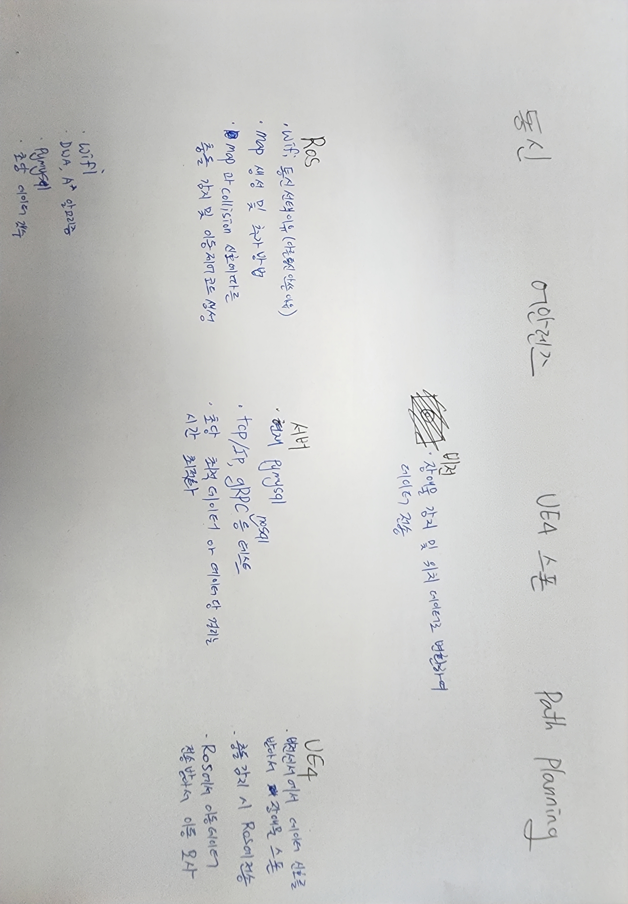

# Game Engine-based Virtual Sensor for Obstacle Avoidance in Sensor-less AMR

## 개요
- 게임 엔진의 콜리전 박스와 카메라 센서를 활용하여 AMR의 센서를 대체하여 AMR의 경량화 및 단순화

## 필요기술

### 서버
- 비전 센서, AMR, UE4 각각 데이터를 전송할 수 있는 최적화된 서버 필요
- 비전 센서 – UE4: 장애물 감지 및 위치 데이터 전송
- 비전 센서 – AMR: 사진을 활용하여 맵 정보 생성
- AMR – UE4: 실시간 Odometry 정보를 전송
- UE4 – AMR: 충돌 신호 전송
- 다른 통신들과 속도 및 안정성 비교 필요
- 초당 적절한 데이터 개수에 대한 최적화 필요

### AMR
- DWA알고리즘과 A* 알고리즘을 사용하여 최적 경로 생성 및 장애물 회피
- 실시간 이동 경로 기반 Odometry 데이터 UE4로 전송
- 비전 센서로 받은 이미지 map 데이터로 변환하여 장애물 정보 확인(선택1)
- UE4로부터 받은 충돌 신호로 임의의 장애물 생성 후 회피(선택2)

### 비전센서
- 실시간 장애물 감지 및 장애물 위치 데이터 생성
- 장애물 정보 및 위치 데이터 UE4에 전송
- 장애물 감지 시 이미지를 AMR에 전송(선택1

### UE4
- 실제 환경을 모사하여 환경 및 AMR의 이동 모사하여 디지털 트윈
- 비전 센서 데이터 기반 실시간 장애물 발생 시 장애물 스폰
- AMR과 장애물에 콜리전 박스를 사용하여 실제 센서 대체 가상센서로 사용
- 장애물과 충돌 시 AMR로 장애물 신호 전송
